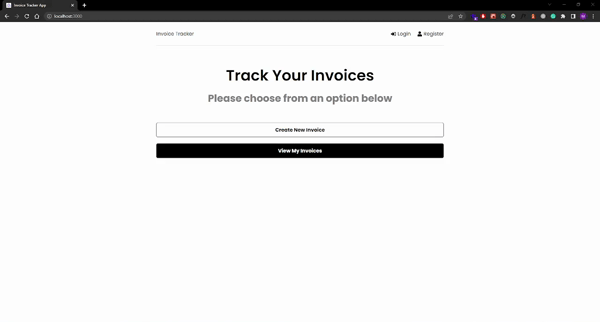

# Invoice Tracker App

This app enables users to create, track and manage their invoices by logging in or creating an account. User account details and invoices are stored in a database using MongoDB. Express was used to build the backend and React along with Redux was used to develop the frontend functionality for user authentication and invoice management.

Users can:

- Track and manage their invoices by logging in or creating an account.
- Create an invoice
- View all invoices
- Update the payment status of an invoice

## Table of contents

- [Demo](#demo)
- [Technologies](#technologies)
- [Languages](#languages)
- [Contact](#contact)

## Demo

View App - [Invoice Tracker](https://invoice-tracker-app-mocodes.herokuapp.com/)

## Technologies

- React
- React Hooks, React Router, React Testing Library
- Redux
- CSS
- Axios
- MongoDB
- Node.js and NPM
- Express
- Postman
- Git & GitHub
- Visual Studio Code (IDE)

## Languages

- JavaScript

## Contact

Coded by Mo - [mocodes](https://mocodes.co.uk/)

Twitter: [@mocodes\_](https://twitter.com/mocodes_)
